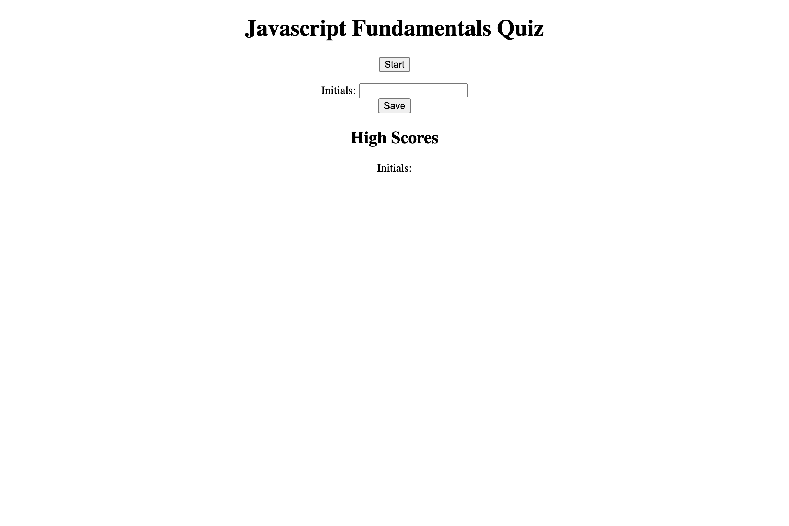

# Javascript_Fundamentals_Quiz

Bootcamp Homework 3 - Creating a quiz

## Summary

This is a click through Javascript quiz. Test your Javascript knowledge by moving through each of the questions. Beat the best time and save your initials.

## Technologies Used

[Github](https://github.com/vinetteg/Javascript_Fundamentals_Quiz)  

## Portfolio Mock Up

## Link To Application

[Deployed Web Page](https://vinetteg.github.io/Javascript_Fundamentals_Quiz/)  
[Repo](https://github.com/vinetteg/Javascript_Fundamentals_Quiz)
